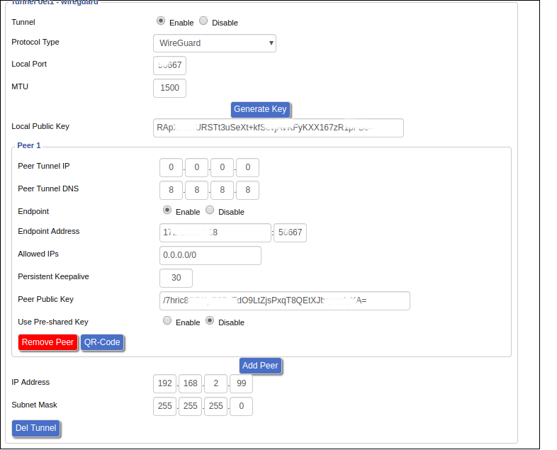
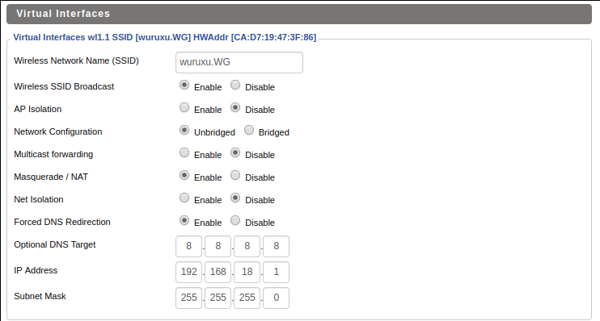
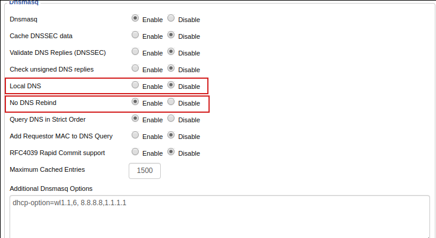

# setup wireguard @ ddwrt

* install latest ddwrt firmware, [BS build](https://download1.dd-wrt.com/dd-wrtv2/downloads/betas/2019/07-04-2019-r40189/) is recommended
* setup wireguard endpoint by following [QuickStart@WireGuard](https://www.wireguard.com/quickstart/)
* add peer config in ddwrt 
* add a VAP (wl1.1 192.168.18.1) in Wireless_Basic.asp 
* save startup rules to forward traffice from wl1.1 to wireguard oet1 (Administration/Command)
```bash
ip rule add from 192.168.18.0/24 lookup 100
ip route add table 100 default via 192.168.2.1 dev oet1
iptables -t nat -A POSTROUTING -s 192.168.18.0/24 -o oet1 -j MASQUERADE
```

* Services -> Services and ensure that DNSMasq is enabled, Enter the following into Additional DNSMasq Options: **dhcp-option=wl1.1,6,8.8.8.8,1.1.1.1** 

Now after your mobile phone connect to VAP, all traffic should forward to wireguard oet1

NOTICE:
* MUST `disable AP Isolation` for Google home setup      
* If something wrong, try to `disable SFE(Shortcut Forwarding Engine)`  @ basic setup.

